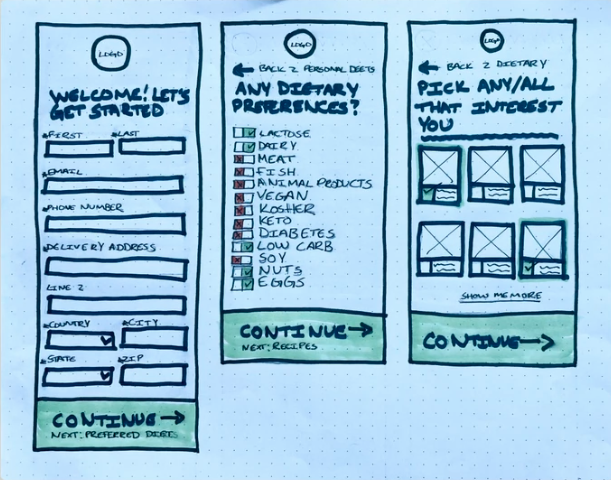
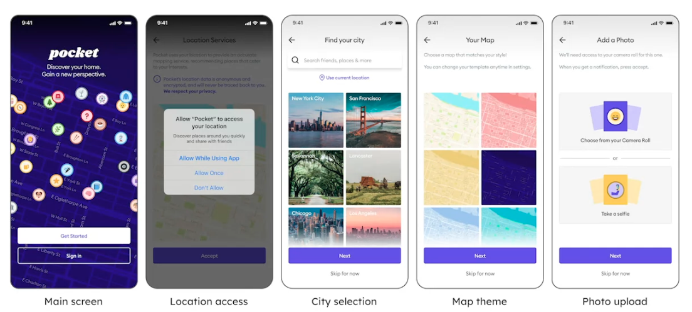
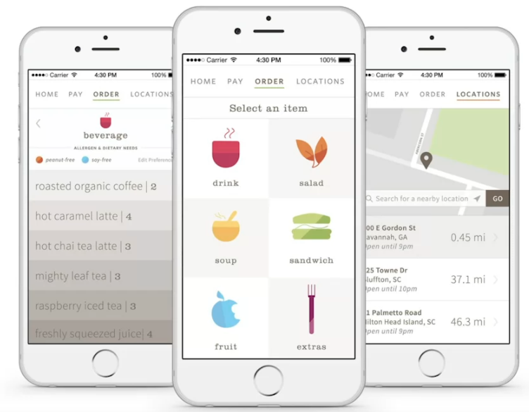
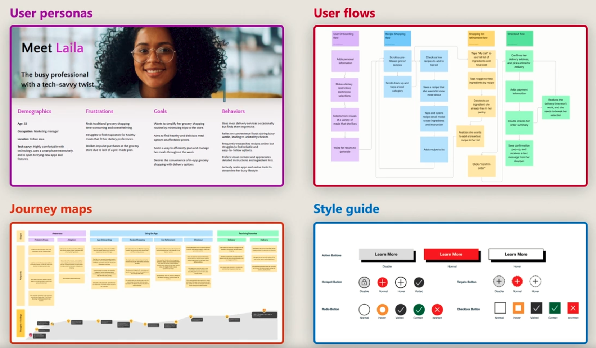
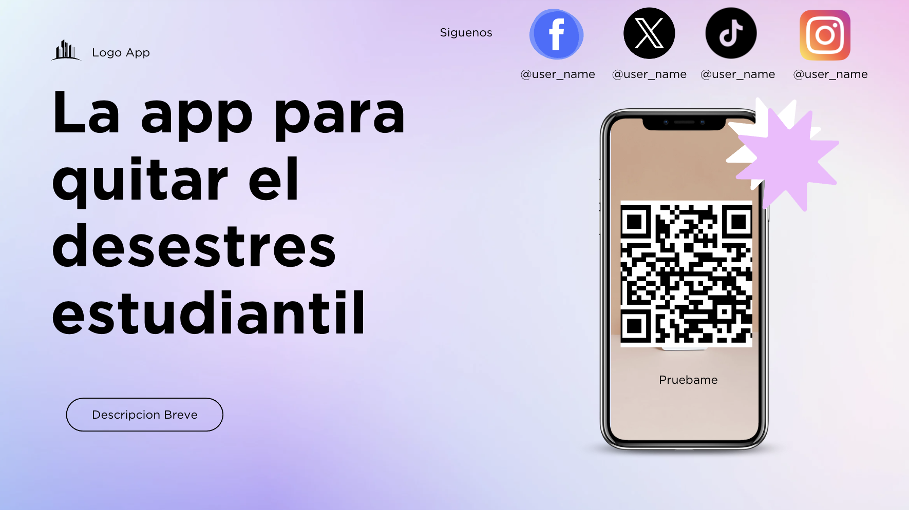

# UX-Elements-and-resources

Mockups

Low Fidelity (Lo-Fi)

Medium Fidelity: Definnir la arquitectura de la informacion.

High Fidelity

Crear un mockup en Figma
1. Crear una nueva pagina
2. Crear frames(capas) en el canvas.
3. Pasa entre proyectos en Figma

Cada documento se llama archivo(file)
Un archivo contiene los canvas, donde creas las capas y objetos para los disenos.
Un archivo tiene sus propios canvas. Estos canvas es: (#ESES5)gris por defecto. Aqui puedes anadir, remover y editar tus disenos.

UX Deriverables(Entregables)
1. Wireframes (Figma)
2. Prototypes (Figma)
3. User personas
   (Figma, Lucid chart)
5. Journey maps and user flows
   (Miro, Lucid chart)
6. Style guide (Figma)

Promocionar la App dentro del plantel
1. Pedir permiso a las autoridades para poder pegar los carteles en sitios que consideren estrategicos. El diseno es libre.
   
Crear un codigo qr que pueda escanearse en: https://qr-code.io/ 
Imprimirlo y disenar un cartel con varias copias que se pegaran en sitios estrategicos del plantel.
El cartel debera ser similar a: 
y redirigira al sitio web que se va a probar y/o app que se va a probar.
Pega los enlaces de Figma, webflow, para crear el/los codigo(s) QR.

Disena el cartel en Figma o en canva o ilustrator, photoshop, etc.
Anade las redes sociales del proyecto que crearon.
Se pueden obtener de aqui: https://www.flaticon.es/iconos-gratis/red-social
En el repositorio hay adjuntos algunos.

Ejemplo de cartel:

Definiciones:
User personas: Personajes ficticios que representan a la audiencia objetivo., ayudan a centrar las necesidades del usuario y centrarlas como diseno.
Journey Maps: ayudan a visualizar como los usuarios navegaran paso a paso, para lograr metas especificas.
User flows: Ayudan a encontrar la secuencia especifica de las actions de los usuarios que tomaran para completar una tarea.
Style guides: Son conjuntos de reglas para el contenido del diseno que ayuda a mantener un estilo consistente. Define cosas como: Tipografia, paletas de colores, y estilos de los botones.

Recursos:
Figma atajos: https://shortcuts.design/tools/toolspage-figma/ 
Generador qr: https://qr-code.io/
Iconos redes sociales: https://www.flaticon.es/iconos-gratis/red-social
